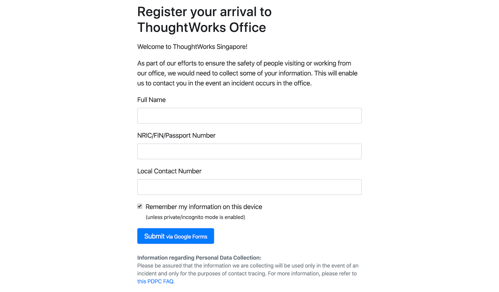

# twsg-register-arrival.github.io
A simple wrapper around a Google Form that caches form data in local storage to ease repetitive form-filling.

When making edits that change the appearance of the page, do update [`thumb.png`](thumb.png)
which is used as the [preview image](https://developers.facebook.com/docs/sharing/webmasters/#basic):

