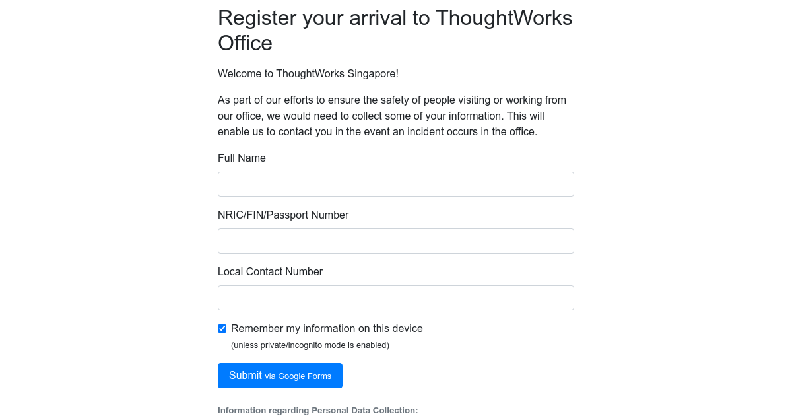

# twsg-register-arrival.github.io
A simple wrapper around a Google Form that caches form data in local storage to ease repetitive form-filling.

## Develop
- Install: `npm install`
- Run: `npm start`
- Test: `npm test`
- Observe tests: `HEADLESS=false npm test`
- Stop: `npm stop`
- Lint: `npm run lint`

## Publish
Note that[`thumb.png`](src/thumb.png) is a screenshot used as the
[OpenGraph preview image](https://developers.facebook.com/docs/sharing/webmasters/#basic):

This is automatically updated if changes are detected when running the screenshot test.
A [browserless](https://github.com/browserless/chrome) container is used to ensure consistency in generation of screenshots.
